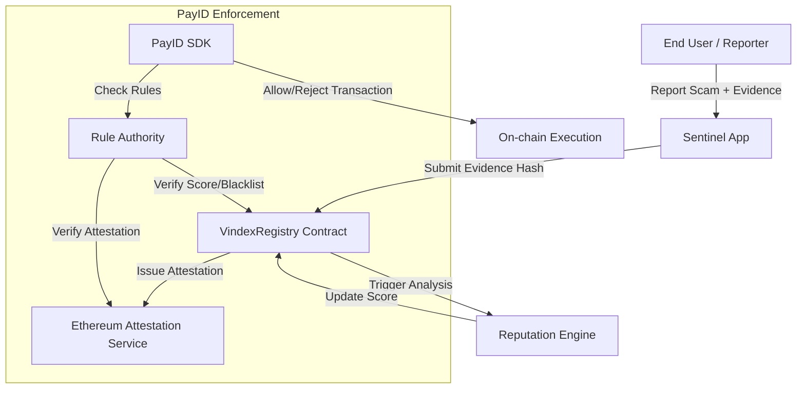

# Architecture Draft: Vindex Reputation & Anti-Scam Network (VRAN)

**Status:** Draft v1.0  
**Project Lead:** The Professor (Nawasena/PayId Architect)  
**Objective:** Provide a universal, decentralized trust layer for Web3 transactions.

---

## 1. High-Level Concept

VRAN is designed as a **Feedback Loop** system that connects user behavior, community reporting, and automated payment enforcement (PayID). It transforms "Social Trust" into "Cryptographic Proof".

### Core Components:
1.  **VindexRegistry (Smart Contract):** The "Source of Truth" for reputation scores and blacklist status.
2.  **SentinelApp (Frontend/Reporting):** An interface for users to report malicious accounts with evidence.
3.  **ReputationEngine (Off-chain/Oracle):** Analyzes reporting patterns and on-chain activity to calculate dynamic scores.
4.  **EAS Bridge:** Emits verifiable attestations whenever a reputation milestone is reached (e.g., "Top 1% Trusted Payer").

---

## 2. Technical Architecture



---

## 3. Data Schema & Logic

### 3.1 Reputation Score (0 - 1000)
- **Base Score:** 500 (Neutral)
- **Positive Factors:** Transaction volume, age of account, successful peer attestations.
- **Negative Factors:** Verified scam reports, involvement in rugpulls, high-frequency "dust" attacks.

### 3.2 Anti-Scam Reporting Flow
1.  **Staked Reporting:** Reporters must stake a small amount of token to prevent spam reporting.
2.  **Evidence Storage:** Metadata/Evidence stored on IPFS/Arweave; only the CID is stored on-chain.
3.  **Consensus:** A report only affects reputation after it reaches a threshold of unique, high-reputation reporters (Web of Trust).

---

## 4. PayID Integration Strategy

PayID can consume VRAN data in two ways:

1.  **Hard Enforcement (Blacklist):**
    ```json
    {
      "id": "blacklist-check",
      "if": { "field": "vran.isBlacklisted", "op": "eq", "value": false },
      "message": "Recipient is a verified scammer."
    }
    ```

2.  **Soft Enforcement (Reputation Threshold):**
    ```json
    {
      "id": "high-trust-only",
      "if": { "field": "vran.score", "op": "gte", "value": 700 },
      "message": "High-value transactions require reputation > 700."
    }
    ```

---

## 5. Roadmap

- **Phase 1:** VindexRegistry MVP (Simple Blacklist + EAS Integration).
- **Phase 2:** Sentinel App (Community Reporting UI).
- **Phase 3:** Advanced Reputation Engine (AI-driven pattern analysis).
- **Phase 4:** Universal API for 3rd party dApps.

---

_Document drafted by Antigravity AI for the PayId-SDK Ecosystem._
